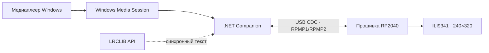

<p align="center">
  
</p>

# RP2040 Media Panel

Настольная медиапанель на базе **RP2040 / YD-RP2040** и дисплея **ILI9341 240×320**. Windows-компаньон читает активную системную медиасессию и передаёт на устройство название трека, исполнителя, альбом, позицию воспроизведения, громкость, обложку и синхронизированный текст.

Когда компьютер не подключён, панель работает автономно и показывает анимированную GIF-заставку. Обмен с ПК идёт через USB CDC Serial по открытому протоколу RPMP1/RPMP2.

## Возможности

- метаданные текущего трека из Windows Media Session;
- обложка 160×160 в формате RGB565;
- плавный прогресс воспроизведения между обновлениями от ПК;
- состояние воспроизведения, системная громкость и mute;
- синхронизированный текст с построчной подсветкой через LRCLIB;
- автоматический поиск совместимого COM-порта и переподключение;
- RPMP2 с бинарной передачей обложек и CRC32, fallback на RPMP1;
- автономная GIF-заставка при запуске или потере связи;
- системный трей, журнал, одиночный экземпляр и автозапуск companion-приложения;
- встроенные тесты надёжности, протокола и companion runtime.

## Как это работает



Companion согласует версию протокола, отправляет метаданные и состояние примерно раз в секунду, а обложку — только при смене трека. Прошивка локально интерполирует прогресс и подсветку текста, поэтому интерфейс остаётся плавным. Если обновлений нет 5 секунд, панель возвращается к заставке.

## Аппаратная часть

- YD-RP2040 или совместимая плата на RP2040;
- SPI-дисплей ILI9341 с разрешением 240×320;
- USB-кабель с передачей данных;
- провода и питание, соответствующее конкретному модулю дисплея.

### Подключение дисплея

Распиновка соответствует текущему [`platformio.ini`](platformio.ini):

| Сигнал ILI9341 | GPIO RP2040 | Назначение |
|---|---:|---|
| MISO | GP16 | данные от дисплея |
| CS | GP17 | выбор дисплея |
| SCK / CLK | GP18 | тактовая линия SPI |
| MOSI | GP19 | данные к дисплею |
| DC / RS | GP20 | команда или данные |
| RST | GP21 | сброс дисплея |
| GND | GND | общая земля |

Встроенный индикатор состояния использует `GP25`. Напряжение `VCC` и подсветки подключайте по документации именно вашего модуля ILI9341: разные платы дисплеев могут иметь разную схему питания и стабилизации.

## Быстрый старт

### 1. Прошивка RP2040

Установите [PlatformIO](https://platformio.org/), откройте корень проекта и выполните:

```powershell
pio run
pio run --target upload
```

Для просмотра загрузочных тестов и диагностических сообщений:

```powershell
pio device monitor --baud 115200
```

После успешного старта в Serial появляются строки:

```text
[SELFTEST] reliability PASS
[SELFTEST] usb-protocol PASS
[INFO] GIF screensaver started
```

Перед запуском Windows companion закройте Serial Monitor: COM-порт может использовать только одно приложение одновременно.

### 2. Windows companion

Требования для сборки:

- Windows 10 версии 2004 или новее;
- .NET 10 SDK.

```powershell
dotnet restore .\companion\Rp2040MediaPanel.Companion\Rp2040MediaPanel.Companion.csproj
dotnet build .\companion\Rp2040MediaPanel.Companion\Rp2040MediaPanel.Companion.csproj -c Release --no-restore
dotnet run --project .\companion\Rp2040MediaPanel.Companion -c Release --no-build
```

Запуск без аргументов открывает небольшое окно управления, включает режим медиасессии, автоматически ищет панель и добавляет значок в системный трей.

### 3. Использование

1. Подключите прошитую панель к ПК по USB.
2. Закройте Serial Monitor и другие программы, занявшие COM-порт.
3. Запустите музыку в приложении, которое публикует Windows Media Session.
4. Запустите companion — порт и текущая медиасессия будут выбраны автоматически.
5. Чтобы завершить фоновый режим корректно, используйте пункт **«Отключить и выйти»** в трее или параметр `--stop-background`.

## Самодостаточная сборка companion

Команда создаёт один EXE для Windows x64, которому не требуется установленный .NET Runtime:

```powershell
dotnet publish .\companion\Rp2040MediaPanel.Companion\Rp2040MediaPanel.Companion.csproj `
  -c Release `
  -r win-x64 `
  --self-contained true `
  -p:PublishSingleFile=true `
  -p:EnableCompressionInSingleFile=true `
  -p:IncludeNativeLibrariesForSelfExtract=true `
  -o .\companion\dist\win-x64-single
```

Результат: `companion\dist\win-x64-single\Rp2040MediaPanel.Companion.exe`.

## Полезные режимы companion

| Аргумент | Назначение |
|---|---|
| `--media-session` | передавать активную медиасессию; без `--port` искать панель автоматически |
| `--background` | скрытый режим с журналом, треем и автопоиском |
| `--port COM20` | использовать указанный COM-порт |
| `--no-lyrics` | не обращаться к сервису синхронизированных текстов |
| `--list` | показать доступные COM-порты |
| `--once` | выполнить `HELLO`, `PING`, `STATUS` и выйти |
| `--watch` | запрашивать состояние каждые 2 секунды |
| `--simulate` | передавать тестовый трек до `Ctrl+C` |
| `--self-test` | проверить parser и runtime без устройства |
| `--install-autostart` | включить фоновый запуск при входе в Windows |
| `--remove-autostart` | удалить companion из автозапуска |
| `--stop-background` | остановить фоновый экземпляр и вернуть заставку |

Подробности о конфигурации, журнале и кеше текстов находятся в [документации companion](companion/README.md).

## Проверка

Сборка прошивки:

```powershell
pio run
```

Самотест companion без подключённой панели:

```powershell
dotnet run --project .\companion\Rp2040MediaPanel.Companion -c Release -- --self-test
```

Полные ручные сценарии собраны в [`TEST_RESULTS.md`](TEST_RESULTS.md), а формат команд и ответов — в [`USB_SERIAL_PROTOCOL.md`](USB_SERIAL_PROTOCOL.md).

## Структура проекта

| Путь | Содержимое |
|---|---|
| `src/app/` | главный цикл, состояния и переходы интерфейса |
| `src/display/` | драйвер дисплея, GIF-заставка и отрисовка UI |
| `src/media/` | автономные и удалённые медиаданные |
| `src/protocol/` | parser и USB Serial RPMP1/RPMP2 |
| `src/diagnostics/` | встроенные самотесты прошивки |
| `include/` | конфигурация, модели, цвета и геометрия UI |
| `assets/` | исходные изображения обложек и баннер README |
| `src/assets/generated/` | подготовленные RGB565/RLE-ресурсы прошивки |
| `tools/` | генераторы обложек, шрифта и заставки |
| `companion/` | Windows-приложение на .NET 10 |

## Настройка интерфейса

- размеры и интервалы обновления: [`include/AppConfig.h`](include/AppConfig.h);
- геометрия элементов: [`include/UiLayout.h`](include/UiLayout.h);
- палитра: [`include/UiColors.h`](include/UiColors.h);
- параметры SPI и выбранное окружение: [`platformio.ini`](platformio.ini);
- исходные обложки: `assets/covers/`;
- шрифт и генераторы ресурсов: `tools/`.

Генерируемые заголовки сохранены в репозитории намеренно: они входят в сборку прошивки и позволяют собрать проект без предварительного запуска Python-генераторов.
